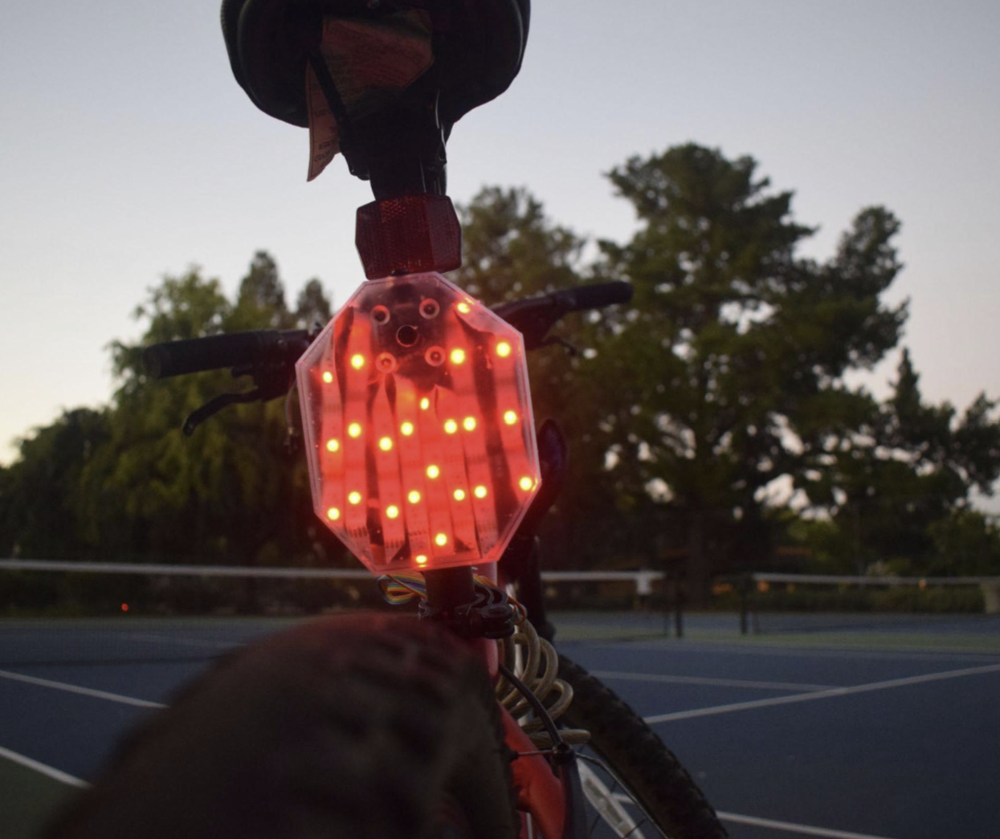

# AI-Powered Smart Bike Light: Enhancing Cyclist Safety Through Real-Time Hazard Detection and Alerts

[](https://www.researchgate.net/publication/394939343_AI-Powered_Smart_Bike_Light_Enhancing_Cyclist_Safety_Through_Real-Time_Hazard_Detection_and_Alerts)
[](https://cad.onshape.com/documents/9705b9fba6ff033fb0240052/w/b2281bc798a1e4d5b26ffbd4/e/0e160a5e9fa38effef129fef?renderMode=0&uiState=66a5237d5aa112772e99c174)
[](https://github.com/APurbiya/Smart-Bike-Light)

<p align="center">
  
</p>

---

## 📌 Project Overview

The **AI-Powered Smart Bike Light** is an edge-AI hardware and software system engineered to protect cyclists by detecting approaching rear vehicles in real time. Utilizing lightweight deep learning models deployed on a Raspberry Pi, the system identifies approaching vehicles and dynamically increases lighting alerts and visual warnings to maximize cyclist visibility.

<p align="center">
  
</p>

### Key Highlights
* 📄 **Published Research Paper:** Read the full publication on [ResearchGate](https://www.researchgate.net/publication/394939343_AI-Powered_Smart_Bike_Light_Enhancing_Cyclist_Safety_Through_Real-Time_Hazard_Detection_and_Alerts).
* 📜 **Patent Pending:** Provisional patent filed for the real-time hazard detection architecture and lighting response system.
* 🛠️ **Custom Hardware Case:** Designed in Onshape and 3D-printed specifically for the Raspberry Pi and camera setup. Access the CAD model on [Onshape](https://cad.onshape.com/documents/9705b9fba6ff033fb0240052/w/b2281bc798a1e4d5b26ffbd4/e/0e160a5e9fa38effef129fef?renderMode=0&uiState=66a5237d5aa112772e99c174).
* ⚡ **Edge AI Acceleration:** Powered by custom TensorFlow Lite object detection models optimized for embedded microcontrollers and single-board computers (Raspberry Pi 3/4).

---

## 🚀 Model Training & Deployment Pipeline

This repository includes the complete pipeline for training custom TensorFlow Lite object detection models and running real-time inference on edge devices (Raspberry Pi, PC, or Android).

<a href="https://colab.research.google.com/github/EdjeElectronics/TensorFlow-Lite-Object-Detection-on-Android-and-Raspberry-Pi/blob/master/Train_TFLite2_Object_Detction_Model.ipynb" target="_blank">
  
</a>

### 1. Model Training (Google Colab)
The fastest way to train and export a TensorFlow Lite model is using Google Colab. The notebook handles data preparation, model configuration, training, and exporting to downloadable `.tflite` format.

* Open the [Google Colab Notebook](./Train_TFLite2_Object_Detction_Model.ipynb) to train on custom datasets.
* For local PC training instructions (legacy), see the [Local Training Guide](doc/local_training_guide.md).

### 2. Setting Up the TFLite Environment
Deploy your `.tflite` model to edge hardware using the step-by-step installation guides located in the [`deploy_guides`](deploy_guides) folder:

* 🍓 **[Raspberry Pi Guide](deploy_guides/Raspberry_Pi_Guide.md):** Setup TFLite Runtime on Raspberry Pi 3/4 (includes Google Coral USB Accelerator support).
* 💻 **[Windows Guide](deploy_guides/Windows_TFLite_Guide.md):** Setup TFLite Runtime using Anaconda.

---

## 💻 Running Inference Scripts

Four Python scripts are provided for running object detection across different input streams:

| Script | Command Example | Description |
| :--- | :--- | :--- |
| **Webcam Feed** | `python TFLite_detection_webcam.py --modeldir=TFLite_model` | Real-time detection using an attached USB camera feed. |
| **Video File** | `python TFLite_detection_video.py --modeldir=TFLite_model --video='test.mp4'` | Performs detection frame-by-frame on local `.mp4` video files. |
| **Web Stream** | `python TFLite_detection_stream.py --modeldir=TFLite_model --streamurl="http://ip:port/stream"` | Real-time detection on network IP cameras or web streams. |
| **Single Image / Directory** | `python TFLite_detection_image.py --modeldir=TFLite_model --imagedir=squirrels` | Inference on individual static images or entire directories. |

> **Note:** Options such as `--save_results` and `--noshow_results` can be added to calculate mAP metrics or run headless evaluations. Use `-h` on any script for full CLI options.

---

## ❓ Frequently Asked Questions (FAQ)

<details>
<summary><b>What is the difference between the TensorFlow Object Detection API and TFLite Model Maker?</b></summary>
<br>
While TFLite Model Maker is straightforward, using the TensorFlow Object Detection API provides several key advantages:
* Supports SSD-MobileNet architectures for faster inference speeds on Raspberry Pi.
* Higher overall detection accuracy on customized edge datasets.
* Granular control over training hyper-parameters (learning rates, loss functions, resolution).
</details>

<details>
<summary><b>Fine-Tuning vs. Transfer Learning vs. Full Training</b></summary>
<br>
* <b>Full Training:</b> Training an entire network from scratch with millions of images.
* <b>Transfer Learning:</b> Freezing early layers and retraining only the output classifier head.
* <b>Fine-Tuning:</b> Unfreezing key feature extraction layers (e.g., top 20–50% of layers) to adapt deep feature representations to vehicle safety classes under varied lighting conditions.
</details>

---

## 📑 Citation & References

If you find this project or research useful in your work, please cite the paper:

```bibtex
@article{purbiya2024smartbikelight,
  title={AI-Powered Smart Bike Light: Enhancing Cyclist Safety Through Real-Time Hazard Detection and Alerts},
  author={Purbiya, Arnav},
  journal={ResearchGate},
  year={2024},
  url={[https://www.researchgate.net/publication/394939343_AI-Powered_Smart_Bike_Light_Enhancing_Cyclist_Safety_Through_Real-Time_Hazard_Detection_and_Alerts](https://www.researchgate.net/publication/394939343_AI-Powered_Smart_Bike_Light_Enhancing_Cyclist_Safety_Through_Real-Time_Hazard_Detection_and_Alerts)}
}
